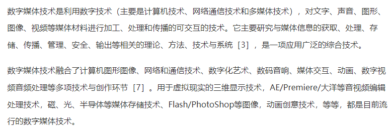

I. 引言
A. AI技术的快速发展
B. 数媒专业的重要性和广泛应用

C. 研究目的和意义

II. AI对内容创作的影响
A. 自然语言处理技术在内容生成中的应用
B. 视频和音频内容的AI生成技术
C. AI对内容个性化和定制化的影响

III. AI对数据分析的影响
A. 机器学习算法在数据分析中的应用
B. AI技术对数据理解和趋势发现的作用
C. AI在数据驱动的内容策略中的应用

IV. AI对内容推荐和个性化服务的影响
A. 深度学习算法在内容推荐中的应用
B. 个性化推荐对用户体验和留存率的影响
C. AI对数媒企业收入的影响

V. AI在数媒专业中面临的挑战和问题
A. 算法偏见和内容推荐的不公平性
B. 数据隐私和用户担忧
C. AI技术发展中的伦理和法律问题

VI. 结论与展望
A. 对AI技术在数媒专业中的影响进行总结
B. 对未来AI发展和数媒专业发展趋势的展望
C. 建议和未来研究方向