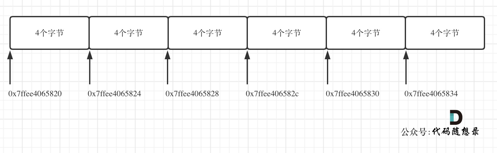

# 数组定义
- 数组是存放在连续内存空间上的相同类型数据的集合
- 数组可以方便的通过下标索引的方式获取到下标下对应的数据。

## 举一个字符数组的例子，如图所示


## 需要两点注意的是
1. ==数组下标都是从0开始的==。
2. 数组内存空间的==地址是连续的==
  数组的在内存空间的地址是连续的，所以我们在删除或者增添元素的时候，就难免要移动其他元素的地址。
  ==数组的元素是不能删的，只能覆盖==。

  ## 那么二维数组 就是套娃 在一维数组中每个单元格再套一个一维数组

  那么二维数组在内存的空间地址是连续吗
  ```
  void test_arr() {
    int array[2][3] = {
		{0, 1, 2},
		{3, 4, 5}
    };
    cout << &array[0][0] << " " << &array[0][1] << " " << &array[0][2] << endl;
    cout << &array[1][0] << " " << &array[1][1] << " " << &array[1][2] << endl;
}

int main() {
    test_arr();
}
```
输出：
```
0x7ffee4065820 0x7ffee4065824 0x7ffee4065828
0x7ffee406582c  0x7ffee4065830 0x7ffee4065834
//在16进制里8 + 4 = c，c就是12。
```
*int数组 每个差四个字节*
