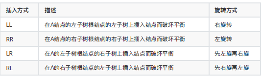
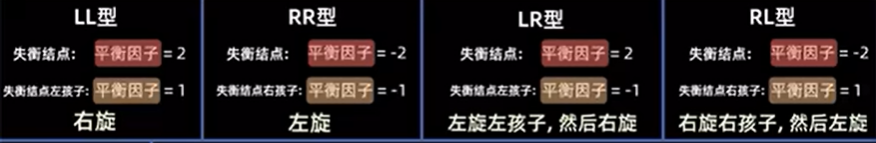
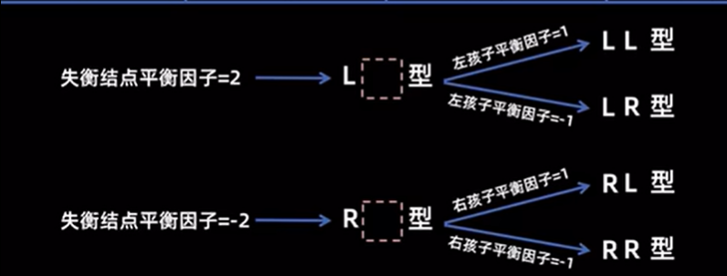

# 二叉平衡树
- 个人初步理解
> 因为BST时间复杂度与高度有关 所以力求在一定节点数 构建高度最小化二叉树.尽可能成完全二叉 满二叉 矮胖
> BST 不稳定 如果初始序列就是有序 容易构造成斜树 -> 链表 查找效率降到O(n).

1. 引入 平衡因子Balance Factor 简称bf 绝对值 <=1
> 每一个节点的左子树高度与右子树高度差

2. DEF：
> *1* 可以是空树
> *2* 非空 保持顺序性 (二叉排序) |平衡因子|<=1
> *3* 任意节点字数也是AVL（递归定义的）

3. 失衡 : |bf|>1

动态图: https://bilibili.com/video/BV1tZ421q72h/?spm_id_from=333.337.search-card.all.click
- 操作 
    1. 查找 与BST一样
    2. 插入 
        1. 先按BST的插入操作
        2. 可能会导致插入节点的长辈失衡 需要判断，有则需要调整
    3. 调整 
        1. 先调成离x长辈（爷爷往上）最近的失衡节点为根的子树(最小失衡子树)只需调整最小平衡树就行了.
    3. 失衡情况
       
       
       
       ==LL 左左得右了 得右旋 LR 先左旋左孩子 再右旋自己 如其名==
     4. how to fix 左右旋
        1. 以失衡节点x为中心右旋 针对LL LR  ---》y=x->left
        y的右孩子变x的左孩子
         x变y右孩子， return y;
        2. 以失衡节点x为中心左旋 同理


## 大话数据结构代码
```C
//模版
#include "studio.h"
#include "stdlib.h"
#include "io.h"
#include "math.h"
#include "time.h"

#define OK 1
#define ERROR 0
#define TRUE 1
#define FALSE 0
#define MAXSIZE 100 

typedef int Status;

//AVL节点 结构
typedef struct AVLTree{
    int data;
    int bf;
    struct AVLNode *left,*right;


}AVLNode,*AVLTree;

void R_Rotate(AVLTree *T);//右旋
void L_Rotate(AVLTree *T);//左旋


void R_Rotate(AVLTree *T)//右旋
{
    AVLTree L;
    L=(*T)->left;
    (*T)->left=L->right;
    L->right=(*T);
    // return L;

}
void R_Rotate(AVLTree *T)//zuo旋
{
    AVLTree L;
    L=(*T)->right;
    (*T)->right=L->left;
    L->left=(*T);
    // return L;

}


```