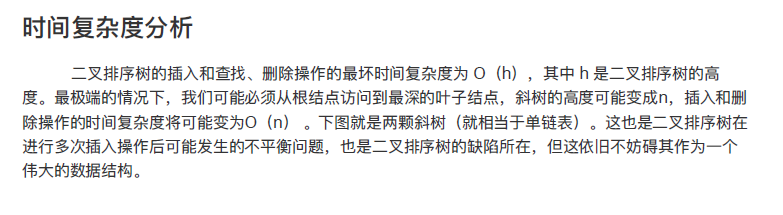

# 二叉排序树/二叉搜索/查找 BST 
Binary Search/sort Tree
## Def:
- *在二叉树基础上增加约束 数据顺序性(只要不空) 左子树<根<右* 
  
### 性质
- 对于普通的树和数组 可以使得插入和删除效率不错，又易于实现查找算法
- 中序遍历序列有序的 左根右递减也可

### 作用
//对一个无序数列构造成一颗二叉排序树 在进行查找 n各节点 h高度 最慢查找h次 完全二叉树为log<sub>2</sub>n + 1 (n>logn)


*BinTree t：这表示一个指向 TreeNode 结构体的指针，也就是说，它指向一个具体的二叉树节点。这个节点包含了该节点的值（data）、左孩子节点的位置（left）、右孩子节点的位置（right）。

BinTree *t：这表示一个指向 BinTree 类型的指针，也就是说，它指向一个二叉树节点指针的地址。这意味着它可以指向指向二叉树节点的指针，通常用于操作指向二叉树节点指针的指针，例如在函数中修改树的结构。**

### 时间复杂度

> 由此引出AVLTree
<hr>

## 大话数据结构代码
```C
//模版
#include "studio.h"
#include "stdlib.h"
#include "io.h"
#include "math.h"
#include "time.h"

#define OK 1
#define ERROR 0
#define TRUE 1
#define FALSE 0
#define MAXSIZE 100 

typedef int Status;


typedef struct TreeNode *BinTree;//结构体指针struct TreeNode* 其名为BinTree
struct TreeNode{
    int data;//值
    BinTree left;//左孩子节点位置
    BinTree right;//右孩子节点位置
}

Status SearchBST(BinTree T,int key,BinTree f,BinTree *p);
//查找实现 递归查找是否存在值key p指针存储的是查找路径最后一个节点 也就是介于两个节点的中间值 
Status noReSearchBST(BinTree T,int key);//非递归查找
Status InsertBST(BinTree *T,int key);//插入操作
Status DeleteBST(BinTree *p);//删除节点操作 重接左或右子树 度为0/1 接一个孩子（比接后继快）/
//如果节点度为2 可以进行值替换 
//用其左子树最右节点 如果前驱节点是被删除节点的左子树中的最大节点，那么它肯定没有右子树，可以直接用它来替换被删除的节点。但如果前驱节点有左子树，需要重新连接它的父节点和左子树。
//或 右子树最左节点 替换 （比替换前驱更方便 不需要加判断）
Status DeleteKEY(BinTree *T,int key);//删除指定值的节点
// 如果需要修改根节点指针的值，就需要传递指向根节点指针的指针，而不是直接传递根节点指针本身。因此，在递归调用时，使用 &((*T)->left) 和 &((*T)->right) 来获取左右子树根节点指针的地址，以便能够修改它们的值。


Status InsertBST(BinTree *T,int key)//用二叉链表存储 初始化
{
    BinTree p,s;//p用于记录s的父亲节点
    if(!SearchBST(*T,key,NULL,&p))//查找不成功 但记录好了父亲节点p；
    {       
        s=(BinTree)malloc(sizeof(struct TreeNode));
        s->data=key;
        s->left=s->right=NULL;

        if(!p) //是空树
        {
            *T=s;//
        }else if(key<p->data)//只要分配p地址成功 最后的遍历的节点 查找里 p=f 进行比较
{   
    p->left=s;
}
    else{
        p->right=s;
    }
    return TRUE;
    }

    return FALSE;


}


//*递归查找二叉树是否存在key* 先跟根节点比较，f指针保存父节点 初始调用为null 查找成功用P指针指向该节点 返回 TRUE 否则则指向查找路径最后一个节点返回false


Status SearchBST(BinTree T,int key,BinTree f,BinTree *p)
{
    if(!T)
    {
        *P=f;//f作为指向最后遍历的节点
        return FALSE;
    }
else if(key==T->data)
{
    *p=T;
    return TRUE;
}
else if(key<T->data)//左子树
{ 
    return SearchBST(BinTree T->left,key,T,p);
    }
else //右子树
{ 
    return SearchBST(BinTree T->right,key,T,p);
    }


}

//非递归查找 while

Status noReSearchBST(BinTree T,int key)
{
    BinTree p=T;//保存pre节点
    
    while(p)
    {
        if(key>p->data)//进入右子树
        {
            p=p->right;
        }
        else if(key<p->data)//进入左子树
        {
            p=p->left;
        }
        else
        {
            return TRUE;
        }

    }
    return FALSE;
}


//删除节点 p 并重接左或右子树 
Status DeleteBST(BinTree *p)
{
    BinTree q,s;//需要q指针来保存被删节点
    if(!*p)//健壮性
    {return FALSE;}
    else if((*p)->right==NULL)//度为1 且右子树空 接左子树 以下左树空同理
    {   
        q=*p; *p=q->left; free(q);
    }
     else if((*p)->left==NULL)//度为1 且右子树空 接左子树 以下左树空同理
    {   
        q=*p; *p=q->right; free(q);
    }

    //度为2 左右子树不空 两种方法 值替换
    //1替换为前驱
    else 
    {
        q=*p;s=(*p)->left;
        while(s->right)//找删除节点的前驱元素 进行替换 线索化查找 q保存他的pre指针（父母节点）
        {
            q=s;
            s=s->right;
        }
    (*p)->data=s->data;

    if(*p!=q)// 需要重接右子树
{
    q->right=s->left;

}
    else
    {
        q->left=s->left;
    }
    free(s);//删除节点
    }
    return TRUE;
    //2替换为后驱 甚至不需要重接
    // else 
    // {
    //     q=*p;s=(*p)->right;
    //     while(s->left)//找删除节点的前驱元素 进行替换 线索化查找 q保存他的pre指针（父母节点）
    //     {
    //         q=s;
    //         s=s->left;
    //     }
    // (*p)->data=s->data;
    //free(s);
    // return TRUE;
}
Status DeleteKEY(BinTree *T,int key)
{
    if(!*T)
    return FALSE;

    else
    {
        if(key==(*T)->data)
        return DeleteBST(*T);
        
        else if(key<(*T)->data)
        return DeleteBST(&((*T)->left),key);
        
        else
        return DeleteBST(&((*T)->right),key);
    }
}


int main(){
    int i ;
    int a[105]={62,88,58,47,35,73,51,99,37,93};
    BinTree T=NULL;

    for(i=0;i<10;i++){
    InsertBST(&T,a[i]);

    }
    DeleteBST(&T,93);
    DeleteBST(&T,47);
    return 0;


}
```