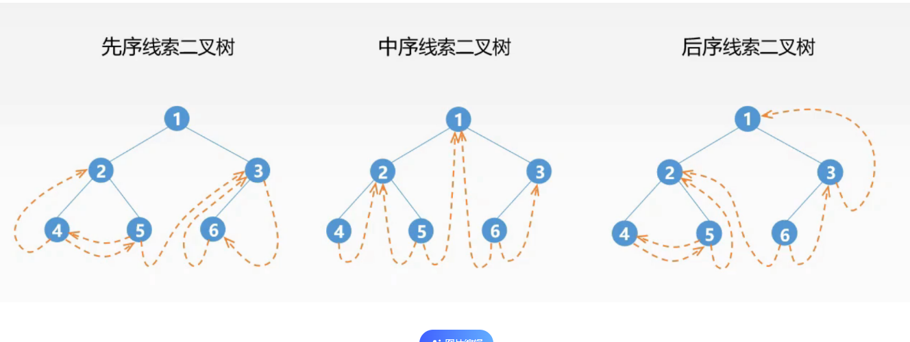

# 二叉排序树 又称线索化二叉树
>**引言 一个n个节点的二叉树，有==2n==个指针域，其中 ==n+1== 个 指针域为空 (利用n-1个是孩子节点 是孩子节点就会被存储需要一个指针域，也就是不为空的指针域会为==n-1,2n-(n-1)=n+1==)**
<b>空间极大浪费 一半有多

例子二 对一个二叉树中序遍历后 求一个节点的前驱后继
如何快速得到某个遍历序列中，某个节点的前驱或后继?一中序遍历为例
既解决空间浪费 也能快速得到前驱后继

利用空链域 对二叉树进行线索化
：如果左孩子为空 指向改节点前驱
：如果右孩子为空 指向改节点后驱
## 左前右后

例子二叉树
```
              A
            /  \
            B   E
             \   \
              C   F
            /    /
            D   G
               / \
               H  K
```
中序遍历: B D C A E H G K F



## 如何添加线索

声明一个变量pre，中序遍历中 保存上一个节点 遍历到x节点是 可以知道pre是x的前驱，则x就是pre的后继，为新添加前驱 为pre添加后继。

具体找前驱 
1. 中序遍历 左中右 找左子树的最右边节点的右线索
2. 左孩子的线索

```c++


#include <stdio.h>
#include <stdlib.h>

// 枚举类型定义
typedef enum { Link, Thread } PointerTag;

// 定义二叉树结点结构
typedef struct TreeNode {
    int data;            // 结点值
    struct TreeNode *left;  // 左孩子指针
    struct TreeNode *right; // 右孩子指针
    PointerTag Ltag;    // 左指针类型
    PointerTag Rtag;    // 右指针类型
} BiThrNode, *BiThrTree;

// 用于保存遍历时的前驱元素指针
BiThrTree pre = NULL;

// 创建二叉树结点
BiThrTree createBiThrNode(int data) {
    BiThrTree newNode = (BiThrTree)malloc(sizeof(BiThrNode));
    if (newNode != NULL) {
        newNode->data = data;
        newNode->left = NULL;
        newNode->right = NULL;
        newNode->Ltag = Link;  // 默认为孩子指针
        newNode->Rtag = Link;  // 默认为孩子指针
    }
    return newNode;
}

// 中序线索化二叉树 和中序遍历代码结构差不多 
void InThreading(BiThrTree p) {
    if (p != NULL) {
        InThreading(p->left); // 左子树线索化

        if (p->left == NULL) { // 左指针为空，建立该节点前驱线索
            p->Ltag = Thread;
            p->left = pre;
        }

        if (pre != NULL && pre->right == NULL) { // 建立前驱结点的后继线索
            pre->Rtag = Thread;
            pre->right = p;
        }

        pre = p; // 保存当前结点作为下一个结点的前驱

        InThreading(p->right); // 右子树线索化
    }
}

// 中序遍历线索二叉树
void InOrderTraverse(BiThrTree T) {
    BiThrTree p = T;

    while (p != NULL) {
        // 找到中序序列的第一个结点
        while (p->Ltag == Link) {
            p = p->left;
        }
        // 访问结点数据
        printf("%d ", p->data);
        // 如果右指针为线索，转到后继结点
        while (p->Rtag == Thread && p->right != NULL) {
            p = p->right;
            printf("%d ", p->data);
        }

        // 转到下一个结点

        p = p->right;
    }
}

int main() {
    // 创建二叉树
    BiThrTree root = createBiThrNode(1);
    root->left = createBiThrNode(2);
    root->right = createBiThrNode(3);
    root->left->left = createBiThrNode(4);
    root->left->right = createBiThrNode(5);
    root->right->left = createBiThrNode(6);
    root->right->right = createBiThrNode(7);

    // 中序线索化二叉树
    InThreading(root);

    // 中序遍历线索二叉树
    printf("Inorder traversal of threaded binary tree: ");
    InOrderTraverse(root);
    printf("\n");

    return 0;
}


```