[toc]
# 大纲要求
| 大纲 | 要求|
|-------|:-------:|
|函数概念 复合函数 分段函数概念 无穷小量的概念  函数连续性概念（左右连续）  闭区间连续函数性质（有界 最大最小值定理）介值定理                                  |理解| 
| 函数表示法 基本初等函数的性质及其图形  极限四则运算法则 两个重要极限求极限方法   无穷小比较方法                                                        | 掌握 |
| 函数 有界单调周期奇偶性 反函数隐函数概念 初等函数概念  连续函数性质和初等函数连续性                                                                     | 了解 |
|应用问题的函数关系 |会建立  |
| 函数间断点的类型 | 会判别 |
| 闭区间连续函数性质 | 会应用 |
| 数列极限和函数极限概念   函数左极限与右极限概念   函数极限存在与左右极限之间的关系| 理解 |
| 无穷大概念 无穷大与无穷小关系 | 理解 |
| 极限性质与存在的两个准则 | 掌握 |
| 极限存在两个准则求极限 | 会用 |
| 等价无穷小求极限 | 会用 |
| 无穷小基本性质 | 理解 |

- [x] sa
 

- “了解know what”：  了解是大纲中最低的要求，就是指考生对概念、公式和理论进行了解，知道是什么意思。一般要求了解的是相关内容，考试深度较浅，考题易得分。   

- “理解know what and why”:  理解就是不仅仅知道概念，还得理解概念的来龙去脉  理解很明显比了解要求高了一个层次，也就是不仅仅要知道是什么意思，还要理解概念的来龙去脉。例如，这个概念为什么会被提出，是从哪个方面提出来的。也就是知其然，知其所以然！   
- “掌握know what why how”:  表示很重要，不但要知道概念、公式和定理，还要知道他们的来龙去脉，还要在不同题型考察时要灵活运用，甚至要做到熟练的解决问题的程度。  
- "会用know how"：  主要是针对于某个概念、结论或是公式，考生只要会用这个概念、公式和结论即可，不用去深究他们。考生只要遇到考查题型会拿出来去解决问题就可以了。 

## 函数  
### 函数概念与常见函数 ()
#### 1. 函数定义: (理解)
其两个基本要素：定义域和对应规则（依赖关系），当定义域和对应规则完全相同时，它们就是同一个函数  
#### 6. 函数表示法   (掌握)
   1. 列表 图示 解析式（一般标明定义域）  
#### 2. 复合函数 (理解)
   def: 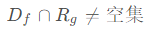  
#### 3. 反函数概念 (了解)
   1. 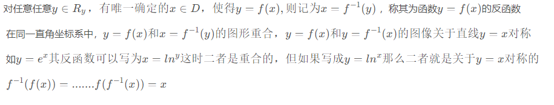  
#### 4. 隐函数概念 (了解)
   1.   
#### 5. 初等函数 性质和图形 (掌握)
    - 幂函数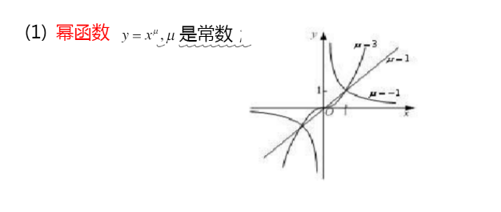
    - 指数 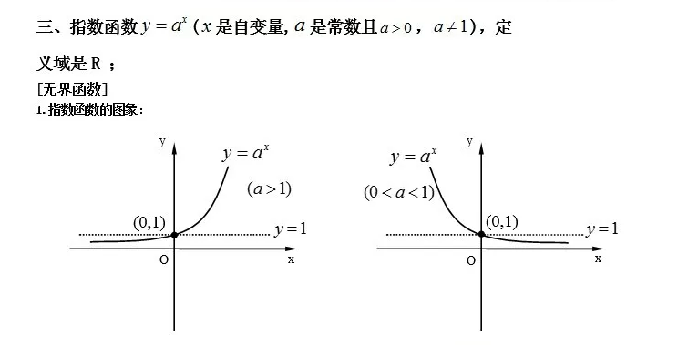
    - 对数 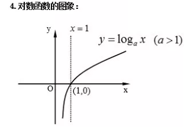
    - 三角 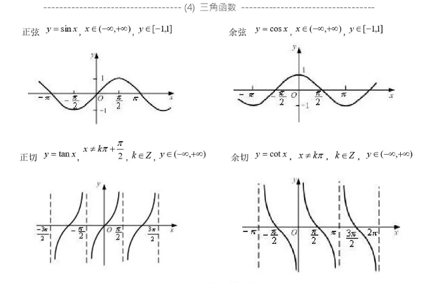
    - 反三角 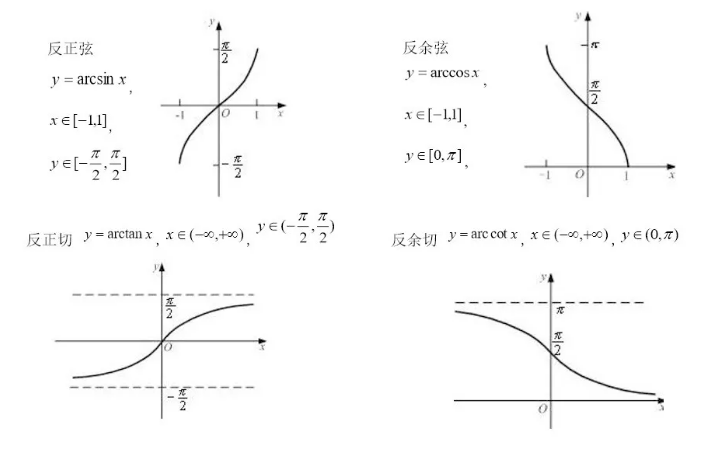  
#### 6. 分段函数 (理解)
def: 根据自变量取值不同范围分成不同的几段函数
$y=sgnx \begin{cases}
		-1， x<0\\
		0,   x=0\\
		1,   x>0
	\end{cases}$
  

### 函数性质 (了解)
#### 1. 单调性 
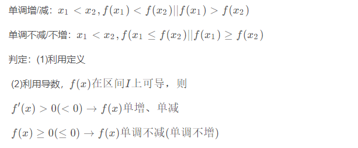
#### 2. 奇偶性 
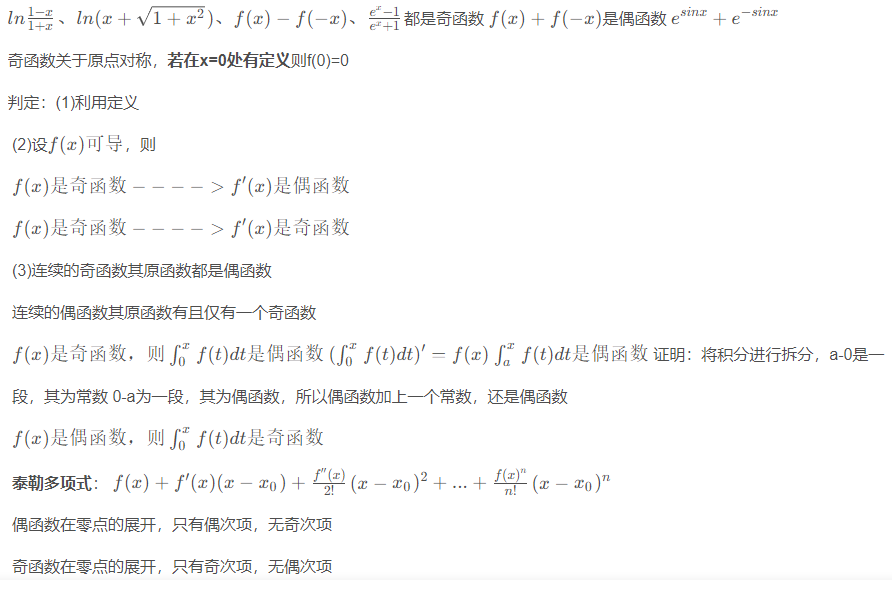
#### 3. 周期性
 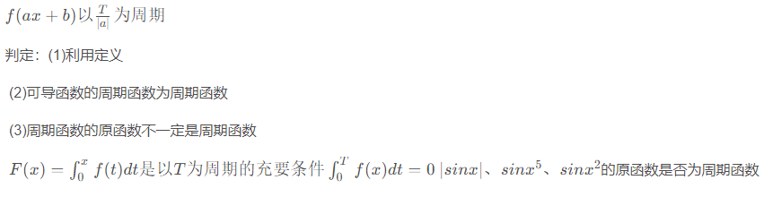
#### 4. 有界性
 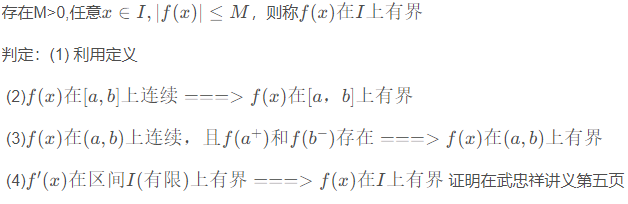

  

## 极限
### 数列极限与函数极限概念 （理解）
#### 1. 数列极限

#### 2. 函数极限
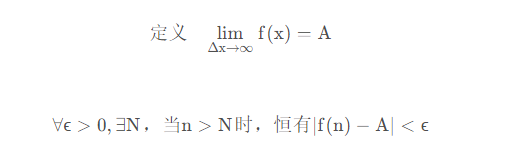
   1. 左极限 右极限概念

#### 3. 极限存在与左极限 右极限关系
   > 左极限 右极限存在且相等
   
   
### 极限的性质与存在两准则 (掌握)

#### 性质
##### 1.有界
##### 2.保号
  

##### 存在准则
###### 1. 夹逼

###### 2. 单调有界

  

### 存在两准则求极限 (会用)

  

### 极限四则运算法则(掌握) 

- [ ] wancheng
  

### 两个重要极限求极限 (掌握)

  

### 无穷小
#### 概念 （理解）

#### 性质 （理解）

#### 比较 （掌握）
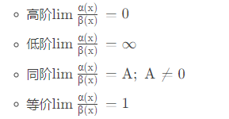
##### 等价无穷小求极限 （会用）
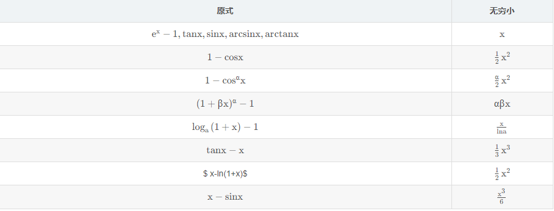

  

### 无穷大（理解）
#### 概念 
#### 性质
#### 与无穷小的关系
  

## 连续
### 概念（理解）

- 左极限 右极限 存在且相等 极限等于函数值
-   

### 间断点类型 (会判定)

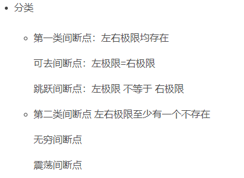
  

### 闭区间连续函数性质（理解）(会用)

  

