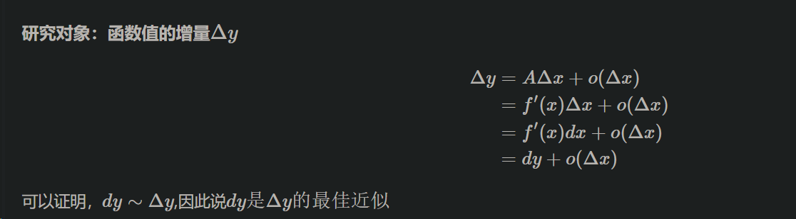
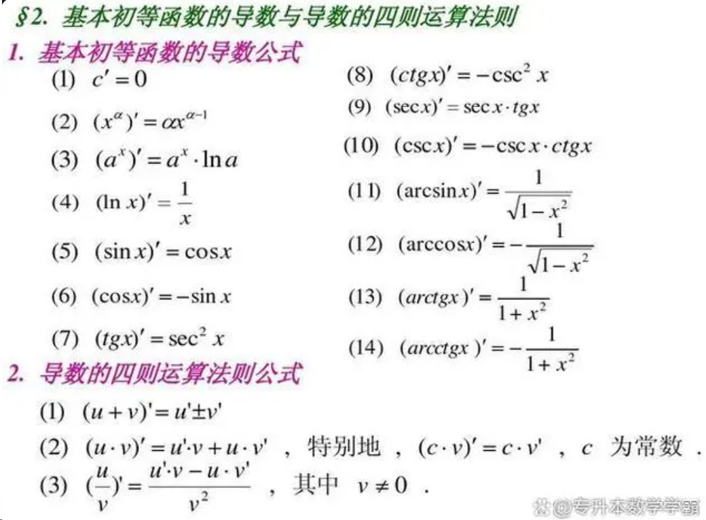

# 导数与微分
**基本概念**
1. 导数
  - 定义：变化率
  
  - 几何意义：切线
    - 设$y=f(x)(x\in D) x_0\in D,在点x_0处自变量x取得增量为$
      $\Delta y=f(x_0+\Delta x)-f(x_0) $
       
  - 物理意义：斜率
    - 设$y=f(x)(x\in D) x_0\in D,在点x_0处自变量x取得增量为$
      $\Delta y=f(x_0+\Delta x)-f(x_0) $
       

- 表示形式

导数左右极限存在且相等充要条件可导 

1. 微分 ：函数改变量近似值
$\Delta y=A\Delta x+o(\Delta x)$

- 几何意义

dy表示切线增量
$\Delta y$表示曲线增量；用微分代替曲线增量的近似值

## 二 导数公式与求导法则
1. 

2. 隐函数求导
求偏导

3. 参数方程求导

4. 反函数求导

